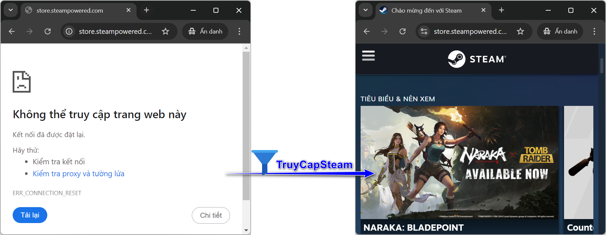
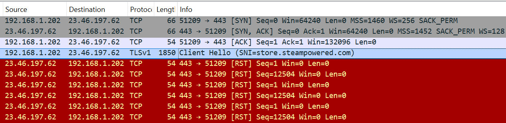
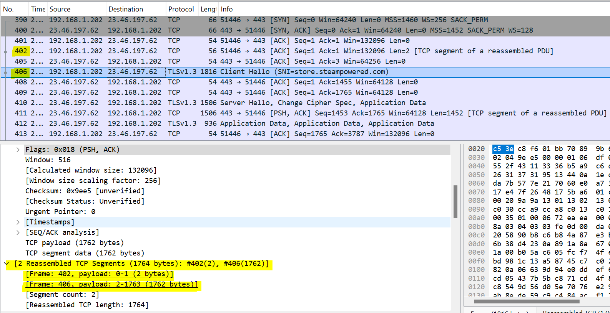

# TruyCapSteam - An app to bypass firewalls

:earth_asia: <sub><sup>[Tiếng Việt :vietnam:](README.md) | [**English :us:**](README.en.md)</sup></sub>



**TruyCapSteam** is an application that can help you access certain websites like [Steam](https://store.steampowered.com/) and [BBC](https://www.bbc.co.uk/), which are blocked by some Internet Service Providers (ISPs) in Vietnam.

## How to Use

1. **Configure DNS over HTTPS (DoH)**: Before using the app, you need to set up DoH to ensure that domain names are resolved without being blocked. Check out the [detailed setup guide](#configure-dns-over-https-doh) below.
2. **Download the app**: Download TruyCapSteam from the [**Release page**](https://github.com/nguyenminh-phuc/TruyCapSteam/releases), then extract the files to a directory.
3. **Run the app**: Start the application with **Admin** rights, then try accessing https://store.steampowered.com/ to test if the connection works.

```
.\TruyCapSteam.exe {OPTIONS}

  TruyCapSteam helps you bypass restrictions placed by some Vietnamese Internet Service Providers that
  block access to websites like Steam and BBC. To test if the app works, run it as an administrator and
  try to visit https://store.steampowered.com/

OPTIONS:

    -h, --help                        Show this help menu
    -p[ports...], --port=[ports...]   HTTPS ports (default: 443)
    -w[window-size]                   TCP window size (default: 2)
    Windows service configuration
      --install                         Install TruyCapSteam as a Windows service
      --uninstall                       Remove TruyCapSteam service
```

### Configure DNS over HTTPS (DoH)

To avoid domain name blocks, follow these steps to set up DoH:
1. Google Chrome: Settings → Privacy and security → Security → Use secure DNS → Select DNS provider: Cloudflare (1.1.1.1)
2. Microsoft Edge: Settings → Privacy, search, and services → Security → Use secure DNS to specify how to lookup the network address for websites → Choose a service provider: Cloudflare (1.1.1.1)
3. Mozilla Firefox: Settings → Privacy & Security → DNS over HTTPS → Enable DNS over HTTPS using: Max Protection → Choose provider: Cloudflare

### Installing TruyCapSteam as a Windows Service
- To install TruyCapSteam as a Windows service, use the `--install` option.
- To remove the service, use the `--uninstall` option.

## How It Works

### The Problem
When you visit the Steam website, your browser sends a **TLS ClientHello** packet to the Steam server. This packet contains **SNI** (Server Name Indication) data, including the domain "store.steampowered.com". Firewalls using DPI detect this, recognize the access attempt to Steam, and block the connection by sending a **TCP RST** making it impossible to access the website.



### The Solution
Most firewalls operate in a "passive" mode to optimize performance. By fragmenting the **ClientHello** packet, the DPI system cannot fully read the SNI information, and therefore the connection is not blocked. This allows you to access the website normally.

### How TruyCapSteam Bypasses DPI
During the **TCP handshake**, after the server sends a **SYN+ACK** packet, TruyCapSteam intercepts and modifies the **TCP window** size to a smaller value. This causes the **ClientHello** packet to be fragmented when sent, making it harder for the ISP’s DPI system to read and block, thereby allowing the connection to succeed.


