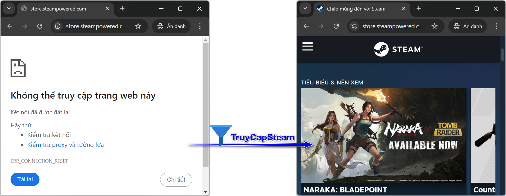
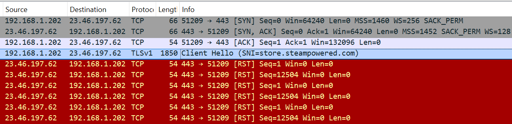

# TruyCapSteam - Phần mềm vượt tường lửa
---
:earth_asia: <sub><sup>[**Tiếng Việt :vietnam:**](README.md) | [English :us:](README.en.md)</sup></sub>



**TruyCapSteam** là ứng dụng hỗ trợ truy cập các trang web như [Steam](https://store.steampowered.com/) hay [BBC](https://www.bbc.co.uk/), vốn bị chặn bởi một số nhà mạng (ISP) tại Việt Nam.

## Hướng dẫn sử dụng

1. **Cấu hình DNS over HTTPS (DoH)**: Trước khi sử dụng phần mềm, ta cần thiết lập DoH để đảm bảo tên miền được phân giải mà không bị chặn. Hãy tham khảo [hướng dẫn chi tiết](#cấu-hình-dns-over-https-doh) bên dưới.
2. **Tải phần mềm**: Tải TruyCapSteam từ [**trang Release**](https://github.com/nguyenminh-phuc/TruyCapSteam/releases), sau đó giải nén vào một thư mục cố định.
3. **Chạy phần mềm**: Khởi động ứng dụng với quyền **Admin** và thử truy cập trang web https://store.steampowered.com/ để kiểm tra.

```
.\TruyCapSteam.exe {OPTIONS}

  TruyCapSteam giúp ta truy cập các trang web bị chặn bởi một số nhà cung cấp dịch vụ Internet ở Việt Nam,
  như Steam và BBC. Để kiểm tra chức năng của ứng dụng, hãy chạy phần mềm với quyền Admin và thử truy cập vào
  https://store.steampowered.com/

OPTIONS:

    -h, --help                        Hiển thị menu trợ giúp
    -p[ports...], --port=[ports...]   Cổng HTTPS (mặc định: 443)
    -w[window-size]                   Kích thước TCP window (mặc định: 2)
    Cấu hình Windows service
      --install                         Cài đặt TruyCapSteam dưới dạng Windows service
      --uninstall                       Xóa TruyCapSteam service
```

### Cấu hình DNS over HTTPS (DoH)
Để tránh bị chặn tên miền, hãy thiết lập DoH như sau:
1. Google Chrome: Cài đặt → Quyền riêng tư và bảo mật → Bảo mật → Sử dụng DNS bảo mật → Chọn nhà cung cấp DNS: Cloudflare (1.1.1.1)
2. Microsoft Edge: Cài đặt → Quyền riêng tư, tìm kiếm và dịch vụ → Bảo mật → Sử dụng DNS an toàn để chỉ định cách tra cứu địa chỉ mạng cho các trang web → Chọn nhà cung cấp dịch vụ: Cloudflare (1.1.1.1)
3. Mozilla Firefox: Cài đặt → Riêng tư & bảo mật → DNS qua HTTPS → Bảo vệ gia tăng → Chọn nhà cung cấp: Cloudflare

### Cài đặt phần mềm dưới dạng Windows service
- Để cài đặt TruyCapSteam như một service Windows, sử dụng tùy chọn `--install`.
- Để gỡ bỏ service, sử dụng tùy chọn `--uninstall`.

## Cách thức hoạt động

### Vấn đề
Khi truy cập vào trang Steam, trình duyệt sẽ gửi một gói tin **TLS ClientHello** đến máy chủ Steam. Gói tin này chứa thông tin **SNI** (Server Name Indication) với tên miền "store.steampowered.com". Tường lửa sử dụng công nghệ DPI sẽ phát hiện ta đang truy cập Steam và chặn yêu cầu bằng cách gửi về **TCP RST** khiến ta không thể truy cập trang web.



### Giải pháp
Phần lớn các tường lửa hoạt động ở chế độ passive "bị động" để tăng hiệu suất. Bằng cách phân mảnh gói tin **ClientHello**, hệ thống DPI sẽ không thể đọc hết thông tin SNI và không chặn được kết nối. Nhờ đó, ta có thể truy cập trang web một cách bình thường.

### Cách TruyCapSteam vượt qua DPI
Trong quá trình **TCP handshake**, sau khi máy chủ gửi gói tin **SYN+ACK**, TruyCapSteam sẽ can thiệp và thay đổi giá trị **TCP window** thành một số nhỏ hơn. Điều này khiến gói tin **ClientHello** bị phân mảnh khi gửi đi, giúp nó "né" được hệ thống DPI của nhà mạng, cho phép kết nối thành công.


